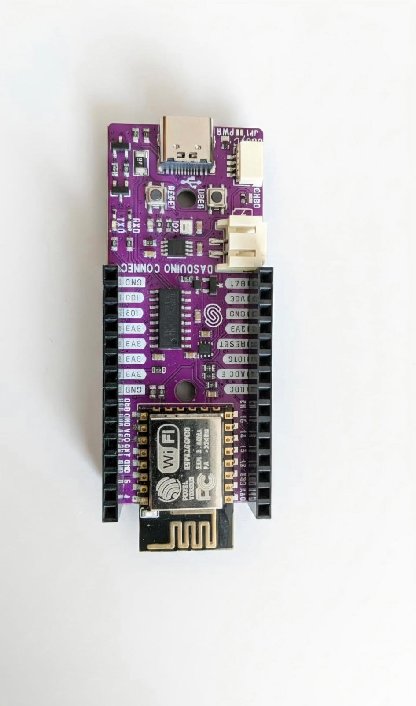
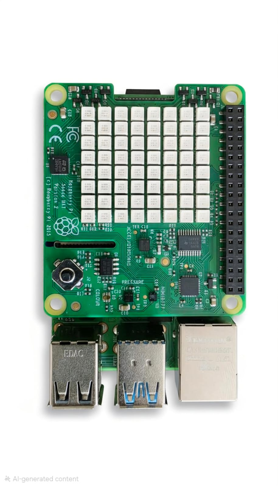
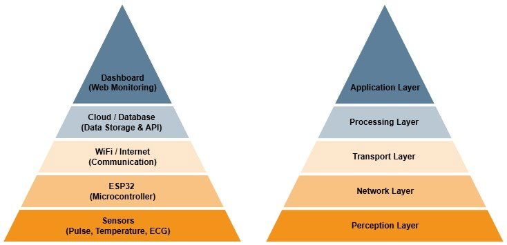
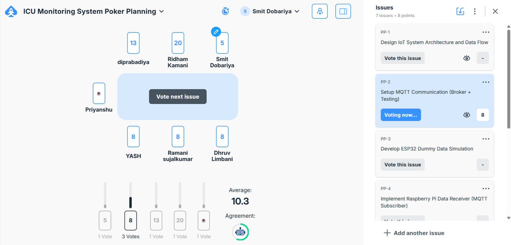
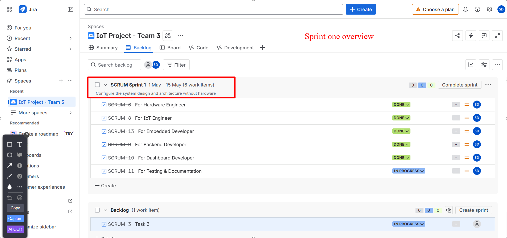
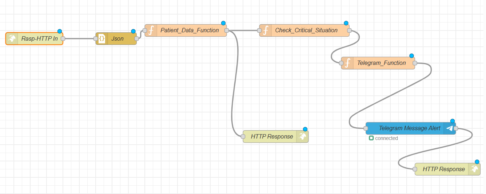
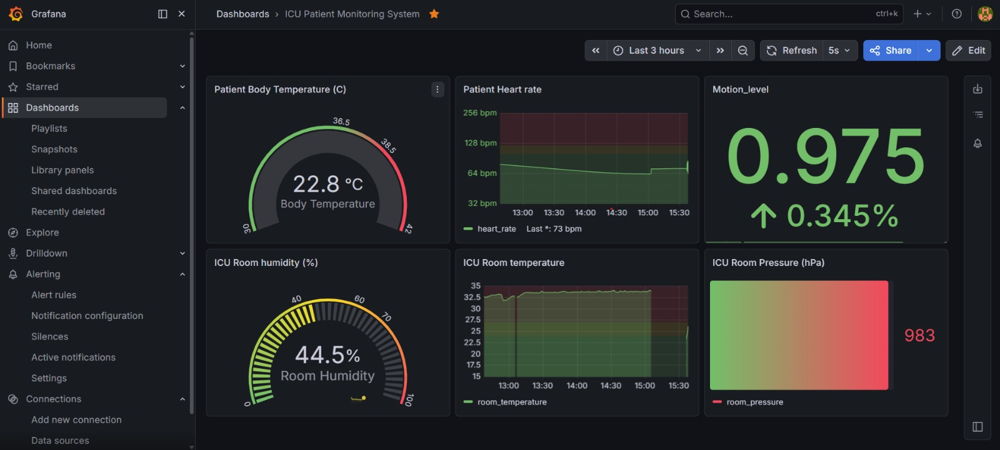
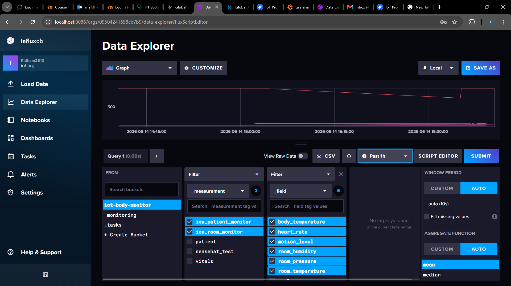

# ICU Patient Monitoring System

An IoT-based healthcare monitoring system developed to provide continuous real-time monitoring of ICU patients using ESP8266, Raspberry Pi, InfluxDB, Grafana, Node-RED, and Telegram notifications.

---

## Project Overview

The ICU Patient Monitoring System is designed to continuously collect, process, store, visualize, and monitor physiological and environmental data within an Intensive Care Unit (ICU).

The system integrates multiple sensors with embedded devices and cloud-based monitoring technologies to provide healthcare personnel with real-time patient information and automated alert notifications.

---

## Objectives

- Develop a real-time ICU monitoring solution
- Monitor physiological and environmental parameters
- Enable continuous sensor data acquisition
- Store data efficiently using a time-series database
- Visualize monitoring data through dashboards
- Generate automated alerts for abnormal conditions
- Demonstrate practical IoT healthcare applications

---

## Features

### Patient Monitoring
- Body Temperature Monitoring
- Heart Rate Monitoring

### Environmental Monitoring
- Room Temperature Monitoring
- Humidity Monitoring
- Pressure Monitoring
- Motion Detection

### Smart Monitoring Features
- Real-Time Data Collection
- WiFi Communication
- Database Storage
- Grafana Dashboard Visualization
- Automated Alert Notifications
- Telegram Bot Integration
- Historical Data Analysis

---

## System Architecture

```text
DS18B20 Sensor
MAX30102 Sensor
Sense HAT Sensors
        │
        ▼
     ESP8266
        │
        ▼
  WiFi Communication
        │
        ▼
   Raspberry Pi 4
        │
 ┌──────┼──────┐
 ▼      ▼      ▼
InfluxDB Node-RED Grafana
   │        │       │
   │        ▼       ▼
   │   Telegram   Dashboard
   │ Notifications
   ▼
Time-Series Storage
```

---

## Hardware Components

| Component | Purpose |
|------------|----------|
| Raspberry Pi 4 | Backend processing and system management |
| ESP8266 | Sensor communication and WiFi transmission |
| DS18B20 Sensor | Body temperature monitoring |
| MAX30102 Sensor | Heart rate monitoring |
| Raspberry Pi Sense HAT | Environmental monitoring |
| Breadboard | Circuit prototyping |
| Jumper Wires | Hardware connections |
| Resistors (4.7kΩ, 10kΩ) | Signal stabilization |

---

## Software Stack

### Embedded Systems
- Arduino IDE
- ESP8266 Libraries
- C/C++

### Backend
- Python
- Raspberry Pi OS

### Database
- InfluxDB

### Visualization
- Grafana

### Alert System
- Node-RED
- Telegram Bot API

### Project Management
- Jira
- GitHub
- Scrum Methodology

---

## Sensor Details

### DS18B20 Temperature Sensor

Used for:

- Body temperature monitoring
- One-Wire communication
- Continuous temperature acquisition

### MAX30102 Sensor

Used for:

- Heart rate monitoring
- I2C communication
- Real-time pulse detection

### Raspberry Pi Sense HAT

Provides:

- Room Temperature
- Humidity
- Pressure
- Accelerometer Data
- Motion Detection

---

## Communication Workflow

```text
Sensors
   ↓
ESP8266
   ↓
WiFi Communication
   ↓
Backend Services
   ↓
InfluxDB
   ↓
Grafana Dashboard
   ↓
Node-RED
   ↓
Telegram Alerts
```

---

## Database Architecture

The project uses InfluxDB as the primary database.

### Stored Measurements

| Field | Description |
|---------|-------------|
| body_temperature | Patient body temperature |
| heart_rate | Heart rate measurements |
| room_temperature | Environmental temperature |
| room_humidity | Room humidity |
| room_pressure | Room pressure |
| motion_level | Accelerometer and movement data |

### Why InfluxDB?

- Optimized for Time-Series Data
- Fast Write Operations
- Real-Time Querying
- Native Grafana Integration
- Lightweight Deployment
- Scalable Architecture

---

## Dashboard Visualization

Grafana dashboards provide:

### Monitoring Panels

- Temperature Panel
- Heart Rate Panel
- Humidity Panel
- Pressure Panel
- Motion Detection Panel
- Room Temperature Panel

### Dashboard Features

- Real-Time Updates
- Time-Series Graphs
- Gauge Visualizations
- Historical Data Tracking
- Continuous Monitoring

---

## Alert Notification System

Node-RED continuously evaluates incoming sensor data.

### Alert Conditions

- High Temperature
- Abnormal Heart Rate
- Environmental Threshold Violations

### Notification Workflow

```text
Sensor Data
     ↓
Node-RED
     ↓
Threshold Evaluation
     ↓
Telegram Bot
     ↓
Alert Notification
```

---

## Project Workflow

### Phase 1
- Project Planning
- Architecture Design
- Requirement Analysis

### Phase 2
- Sensor Evaluation
- Hardware Selection
- Communication Design

### Phase 3
- Backend Development
- Database Setup
- Dashboard Development

### Phase 4
- Hardware Integration
- Sensor Testing
- Communication Validation

### Phase 5
- Final Integration
- System Testing
- Documentation

---

## Testing and Validation

The system was tested using multiple testing approaches.

| Testing Type | Purpose |
|-------------|----------|
| Unit Testing | Validate individual modules |
| Integration Testing | Verify module communication |
| Communication Testing | Validate WiFi transmission |
| Database Testing | Verify storage and retrieval |
| Dashboard Testing | Validate visualization |
| End-to-End Testing | Verify complete workflow |

### Successfully Validated

✅ Sensor Communication

✅ WiFi Data Transmission

✅ Database Storage

✅ Dashboard Visualization

✅ Node-RED Automation

✅ Telegram Notifications

✅ Complete End-to-End Workflow

---

## Repository Structure

```text
IOT-Project-Team-3
│
├── ESP32/
│   ├── Sensor_Code/
│   ├── Communication/
│   ├── DS18B20/
│   └── MAX30102/
│
├── Documentation/
│   ├── Images/
│   ├── Diagrams/
│   └── Report/
│
├── README.md
│
└── LICENSE
```

---

## Team Members

| Team Member | Role |
|------------|------|
| Smit Dobariya | Project Manager |
| Priyanshu Dudhat | Hardware Engineer |
| Yash Desai | Embedded Developer |
| Dhruv Limbani | IoT Engineer |
| Ridhamkumar Kamani | Backend Developer |
| Sujalkumar Ramani | Dashboard Developer |
| Dip Rabadiya | Testing & Documentation |

---

## Technologies Used

- Internet of Things (IoT)
- ESP8266
- Raspberry Pi
- Arduino IDE
- Python
- InfluxDB
- Grafana
- Node-RED
- Telegram Bot
- GitHub
- Jira
- Scrum
- Agile Development

---

## Challenges Faced

- Hardware delivery delays
- Sensor integration complexity
- Communication synchronization
- Sensor calibration
- MAX30102 soldering requirements
- Backend integration dependencies

The team adopted a software-first development strategy using simulated sensor data to continue development before hardware arrival.

---
## Project Images

### ESP8266 Development Board


### Raspberry Pi with Sense HAT


### MAX30102 Heart Rate Sensor


### DS18B20 Temperature Sensor


### Circuit Design


### IoT Architecture


### Planning Poker Session


### Jira Scrum Board


### Node-RED Alert Flow


### Grafana Dashboard


### InfluxDB Dashboard


## Future Improvements

- SpO₂ monitoring integration
- Additional ICU patient sensors
- ECG monitoring
- Mobile application support
- Cloud deployment
- AI-based predictive analytics
- Advanced healthcare dashboards
- Remote patient monitoring

---

## Academic Information

**Project Title:** ICU Patient Monitoring System

**Course:** PTI90010 IoT Project / PTI90190 Computer Science Project

**University:** Westsächsische Hochschule Zwickau (WHZ), Germany

---

## License

This project was developed for academic and educational purposes.

---

## Acknowledgements

We thank the Faculty of Physical Engineering and Computer Science at Westsächsische Hochschule Zwickau for supporting this project and providing the opportunity to apply IoT technologies in a healthcare monitoring environment.
